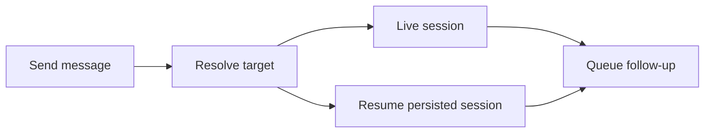

<div align="center">


# DSH Bridge

[English](README.md) · [简体中文](README.zh.md)

[](https://www.npmjs.com/package/dsh-bridge) [](LICENSE) [](https://github.com/topics/dsh-plugin)

</div>

Let sessions in one DeepSeek Harness host discover each other and exchange messages. Bridge is the local foundation beneath Chat rooms and trusted Weave delivery.

## Five tools, one local host

| Tool | Purpose |
| --- | --- |
| `session_list` | Discover sessions, their state, and the workspace each belongs to. |
| `session_spawn` | Create a new top-level session and hand it a task in one call. |
| `session_status` | Report workspace/project ownership and runtime state for one session or all. |
| `session_send` | Send by exact session ID or human-readable title. |
| `session_messages` | Read a bounded recent delivery log. |

## Quick start

```bash
dsh plugin --profile web add dsh-bridge@latest
dsh web
```

Ask an agent to list sessions, then send a message to the intended session. Bridge adds tools directly; it has no separate settings page.

For `session_send`, `mode: auto` tries the ID before the title; `id` and `name` select one lookup method. Titles match case-insensitively. Ambiguous names return candidate IDs instead of choosing a recipient for you.

## Finding the right target

`session_list` returns bare session IDs by default, unchanged from earlier releases. `session_list({ verbose: true })` and `session_status` add the fields that make a target identifiable without reading the session directory by hand: title, working directory, owning workspace, and runtime state (`waking` / `running` / `idle` / `offline` / `archived` / `missing`). `session_status` also covers persisted sessions that have no live agent yet, which the live-only listing cannot show.

A session's workspace comes from the registry's durable account; when the account does not list it, the session's own canonical `cwd` is matched against registered workspace paths. A session that belongs to no registered workspace reports `null` rather than guessing.

## Spawning a peer session

`session_spawn` creates the same kind of conversation the sidebar shows — a durable top-level session, not a subagent child — in the caller's working directory. It attaches the new session to that workspace, mounts the caller's preset, gives it the caller's model route, and delivers the task as its first user message.

The call returns as soon as the task is queued; it never waits for the task to finish. Use the returned `sessionId` with `session_send` to follow up, and with `session_status` to see where it landed.

## Delivery that respects session state



- Idle agents wake; running agents receive queued work.
- Persisted sessions resume with their recorded preset and model.
- Concurrent requests to a cold session share one resume operation.
- Archived sessions reject delivery and are not woken.
- Cancelling during a cold resume prevents a late follow-up, even if the shared load finishes.
- `session_spawn` queues the task on the session it just created and returns. Cancelling that call before the session exists creates nothing; cancelling it after the session exists still delivers, so a conversation is never left without its first message.

A delivery acknowledgement means the session accepted the follow-up. It does not mean the model has processed it or completed the task.

## Configuration

| Field | Default | Purpose |
| --- | --- | --- |
| `recentMessages` | `1000` | Retained messages per host. |
| `dedupeCapacity` | `10000` | Remembered external message IDs. |
| `maxMessagesPerRead` | `100` | Maximum messages returned per read. |

## Plugin integration

`ctx.dshBridge` is the public service. Trusted transports call `deliverExternal()` so local and external delivery share the same follow-up and audit path. Its optional `signal` carries cancellation through session resolution.

[DSH Weave](https://github.com/baixianger/dsh-weave) supplies cross-host transport; [DSH Chat](https://github.com/baixianger/dsh-chat) supplies rooms and a Web conversation view. Neither is required for local messaging.

## Retention & boundaries

Bridge operates within one host process. Its recent-message log and duplicate-ID table live in memory and reset on plugin unload or reload; they are not a durable mailbox. The old `ctx.sessionMessaging` accessor remains a temporary compatibility alias.

## Development & feedback

```bash
npm ci
npm run check
```

[Report an issue](https://github.com/baixianger/dsh-bridge/issues) · [Release notes](RELEASES.md) · [MIT license](LICENSE)
