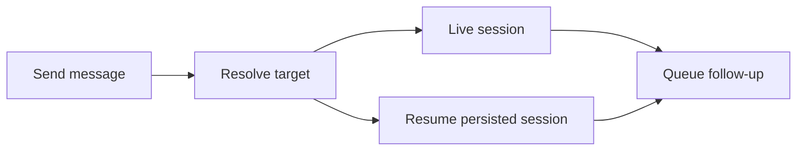

<div align="center">


# DSH Bridge

[English](README.md) · [简体中文](README.zh.md)

[](https://www.npmjs.com/package/dsh-bridge) [](LICENSE) [](https://github.com/topics/dsh-plugin)

</div>

Let sessions in one DeepSeek Harness host discover each other and exchange messages. Bridge is the local foundation beneath Chat rooms and trusted Weave delivery.

## Three tools, one local host

| Tool | Purpose |
| --- | --- |
| `session_list` | Discover sessions and their current state. |
| `session_send` | Send by exact session ID or human-readable title. |
| `session_messages` | Read a bounded recent delivery log. |

## Quick start

```bash
dsh plugin --profile web add dsh-bridge@latest
dsh web
```

Ask an agent to list sessions, then send a message to the intended session. Bridge adds tools directly; it has no separate settings page.

For `session_send`, `mode: auto` tries the ID before the title; `id` and `name` select one lookup method. Titles match case-insensitively. Ambiguous names return candidate IDs instead of choosing a recipient for you.

## Delivery that respects session state



- Idle agents wake; running agents receive queued work.
- Persisted sessions resume with their recorded preset and model.
- Concurrent requests to a cold session share one resume operation.
- Archived sessions reject delivery and are not woken.
- Cancelling during a cold resume prevents a late follow-up, even if the shared load finishes.

A delivery acknowledgement means the session accepted the follow-up. It does not mean the model has processed it or completed the task.

## Configuration

| Field | Default | Purpose |
| --- | --- | --- |
| `recentMessages` | `1000` | Retained messages per host. |
| `dedupeCapacity` | `10000` | Remembered external message IDs. |
| `maxMessagesPerRead` | `100` | Maximum messages returned per read. |

## Plugin integration

`ctx.dshBridge` is the public service. Trusted transports call `deliverExternal()` so local and external delivery share the same follow-up and audit path. Its optional `signal` carries cancellation through session resolution.

[DSH Weave](https://github.com/baixianger/dsh-weave) supplies cross-host transport; [DSH Chat](https://github.com/baixianger/dsh-chat) supplies rooms and a Web conversation view. Neither is required for local messaging.

## Retention & boundaries

Bridge operates within one host process. Its recent-message log and duplicate-ID table live in memory and reset on plugin unload or reload; they are not a durable mailbox. The old `ctx.sessionMessaging` accessor remains a temporary compatibility alias.

## Development & feedback

```bash
npm ci
npm run check
```

[Report an issue](https://github.com/baixianger/dsh-bridge/issues) · [Release notes](RELEASES.md) · [MIT license](LICENSE)
