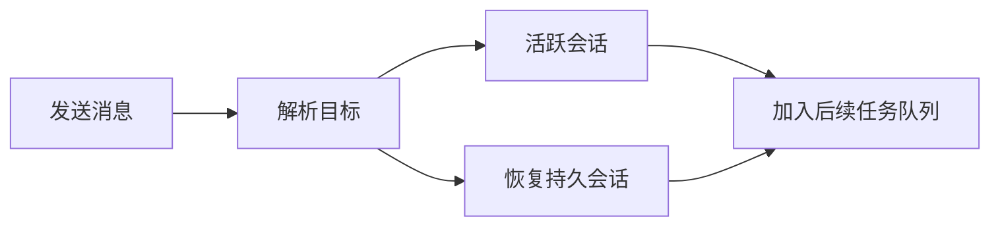

<div align="center">


# DSH Bridge

[English](README.md) · [简体中文](README.zh.md)

[](https://www.npmjs.com/package/dsh-bridge) [](LICENSE) [](https://github.com/topics/dsh-plugin)

</div>

让同一 DeepSeek Harness 主机内的会话发现彼此并交换消息。Bridge 是 Chat 房间和受信任 Weave 投递共用的本地基础层。

## 三个工具，连接本机会话

| 工具 | 用途 |
| --- | --- |
| `session_list` | 查看会话及当前状态。 |
| `session_send` | 按准确会话 ID 或可读标题发送消息。 |
| `session_messages` | 读取有界的近期投递记录。 |

## 快速开始

```bash
dsh plugin --profile web add dsh-bridge@latest
dsh web
```

请 Agent 先列出会话，再给目标会话发送消息。Bridge 直接提供工具，没有独立设置页。

`session_send` 的 `mode: auto` 先匹配 ID，再匹配标题；`id`、`name` 可以指定一种方式。标题匹配不区分大小写，重名时返回候选 ID，不会自行选择收件人。

## 遵循会话状态投递



- 空闲 Agent 会被唤醒，运行中的 Agent 接收排队任务。
- 持久会话按记录中的 preset 和模型恢复。
- 并发请求共用同一冷会话恢复过程。
- 已归档会话拒绝投递，不会被唤醒。
- 恢复期间取消会阻止迟到的后续任务，即使共享加载最终完成。

投递确认表示会话接受了后续任务，不表示模型已经处理消息或完成工作。

## 配置

| 字段 | 默认值 | 用途 |
| --- | --- | --- |
| `recentMessages` | `1000` | 每台主机保留的近期消息数。 |
| `dedupeCapacity` | `10000` | 记住的外部消息 ID 数量。 |
| `maxMessagesPerRead` | `100` | 单次读取的消息上限。 |

## 插件集成

公开服务是 `ctx.dshBridge`。受信任传输层调用 `deliverExternal()`，让本地与外部投递使用相同的 follow-up 和审计路径；可选的 `signal` 将取消传递到会话解析。

[DSH Weave](https://github.com/baixianger/dsh-weave) 提供跨主机传输，[DSH Chat](https://github.com/baixianger/dsh-chat) 提供房间和 Web 对话界面。本地消息功能无需安装它们。

## 保留范围与边界

Bridge 作用于一个主机进程。近期消息和去重表保存在内存中，插件卸载或重载后会清空，不是持久邮箱。旧的 `ctx.sessionMessaging` 访问器暂时保留作兼容别名。

## 开发与反馈

```bash
npm ci
npm run check
```

[提交问题](https://github.com/baixianger/dsh-bridge/issues) · [版本记录](RELEASES.md) · [MIT 许可证](LICENSE)
